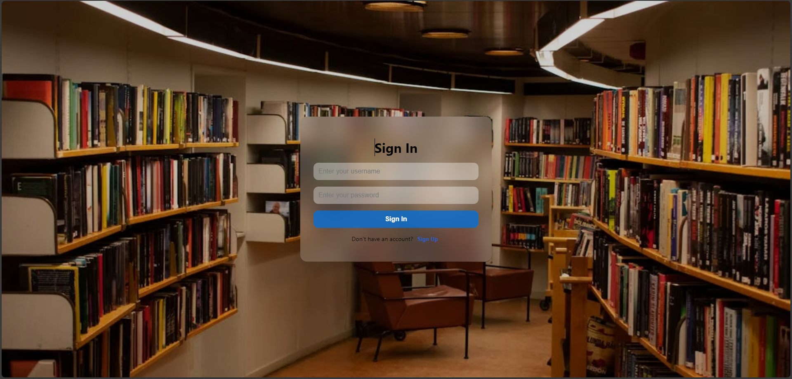
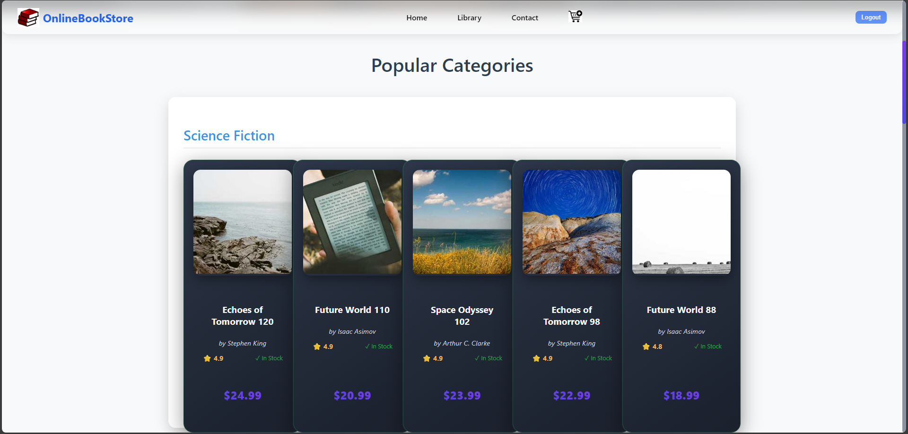
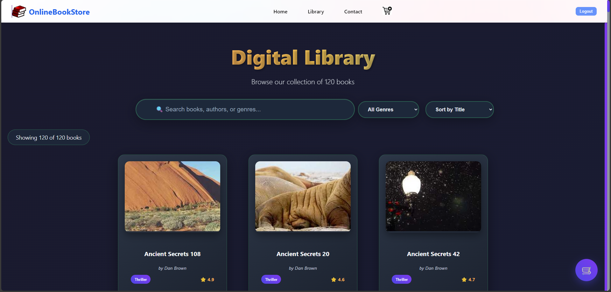
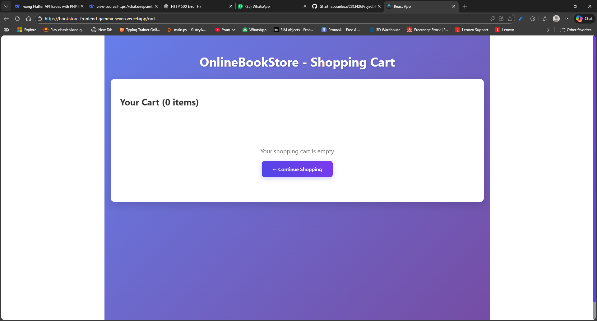
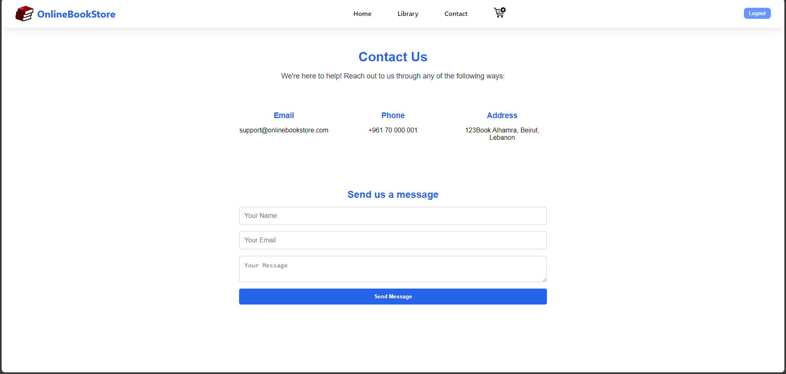

# Project Description

A full-featured digital library platform built with React and Node.js that provides users with a seamless book browsing and purchasing experience. The system features secure user authentication, an interactive book catalog with advanced search capabilities, and a complete shopping cart workflow.

# Key Features:

User Authentication – Secure registration and login system with MySQL database storage

Home Dashboard – Personalized book recommendations and featured selections

Interactive Library – Browse 120+ books with real-time search, filtering, and sorting options

Smart Shopping Cart – Add/remove books, adjust quantities, and review orders

Checkout Process – Complete purchase with order summary and total calculation

Modern Interface – Responsive design with smooth animations and intuitive navigation

# User Flow:

Registration/Login → Users create accounts or sign in securely

Home Exploration → Discover suggested and featured books

Library Browsing → Search, filter, and explore the complete book collection

Cart Management → Add desired books to cart with quantity control

Purchase Confirmation → Review order and complete checkout

 # Setup & Installation
Prerequisites:

Node.js (v16 or higher)

XAMPP (for MySQL database)

Git

Step-by-Step Setup:
Start Database Services:

Launch XAMPP Control Panel

Start Apache and MySQL services

Open phpMyAdmin at http://localhost/phpmyadmin

Create Database:

 # sql:  

CREATE DATABASE login;
USE login;
CREATE TABLE users (
    id INT AUTO_INCREMENT PRIMARY KEY,
    username VARCHAR(50) UNIQUE NOT NULL,
    password VARCHAR(255) NOT NULL
); 

# Launch Backend Server:

bash
cd backend
npm install
npm start
# Server available at http://localhost:5000
Launch Frontend Application:

bash
npm install
npm start
# Application available at http://localhost:3000
Access the Platform:

Open browser

Navigate to http://localhost:3000

Register new account or login

Begin exploring the library

## 📸 Application Screenshots

### 1. Login Page

_User authentication with registration and login options_

### 2. Home Page

_Welcome dashboard with featured books and navigation_

### 3. Library Page

_Book browsing interface with search, filters, and book cards_

### 4. Shopping Cart

_Shopping cart with item management and checkout options_

### 5. Contact Page

_Contact form and information section_

